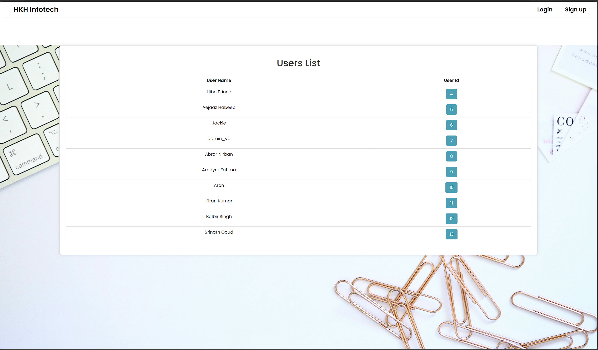
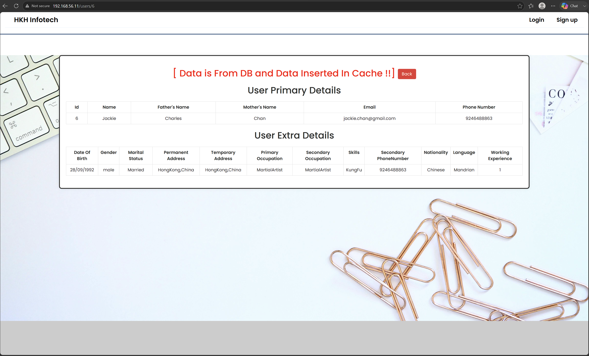
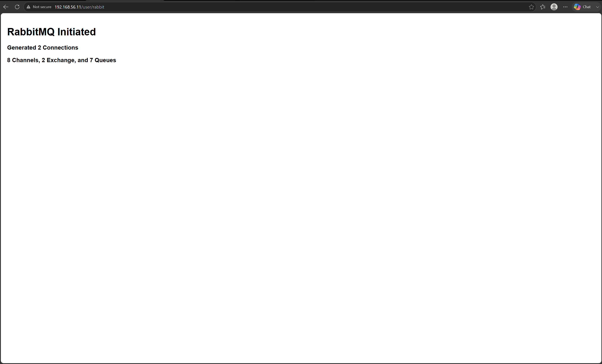

# 🚀 VProfile Multi-VM DevOps Project

A multi-VM DevOps project built using **Vagrant and VirtualBox** to simulate a production-like application infrastructure.

This project demonstrates the deployment and integration of a Java web application with multiple backend services running on separate virtual machines.

## 🏗️ Architecture

```text
                    ┌──────────────┐
                    │    Client    │
                    └──────┬───────┘
                           │
                           ▼
                    ┌──────────────┐
                    │    Nginx     │
                    │    web01     │
                    │192.168.56.11 │
                    └──────┬───────┘
                           │
                           ▼
                    ┌──────────────┐
                    │    Tomcat    │
                    │    app01     │
                    │192.168.56.12 │
                    └──────┬───────┘
                           │
          ┌────────────────┼────────────────┐
          │                │                │
          ▼                ▼                ▼
     ┌─────────┐     ┌───────────┐    ┌──────────┐
     │ MariaDB │     │ Memcached │    │ RabbitMQ │
     │  db01   │     │   mc01    │    │  rmq01   │
     │ .15     │     │   .14      │    │   .13    │
     └─────────┘     └───────────┘    └──────────┘
```

## 🖥️ Virtual Machines

| VM | Role | IP Address | Operating System |
|---|---|---|---|
| `web01` | Nginx Reverse Proxy | `192.168.56.11` | Ubuntu 22.04 |
| `app01` | Apache Tomcat Application Server | `192.168.56.12` | CentOS Stream 9 |
| `rmq01` | RabbitMQ Message Broker | `192.168.56.13` | CentOS Stream 9 |
| `mc01` | Memcached Cache Server | `192.168.56.14` | CentOS Stream 9 |
| `db01` | MariaDB Database Server | `192.168.56.15` | CentOS Stream 9 |

## 🛠️ Technologies

- Vagrant
- VirtualBox
- Nginx
- Apache Tomcat
- Java 17
- Maven
- MariaDB
- Memcached
- RabbitMQ
- Git

## ⚙️ Project Workflow

1. Provision multiple virtual machines using **Vagrant**.
2. Configure private networking and hostnames using **Vagrant Host Manager**.
3. Deploy MariaDB as the application database.
4. Configure Memcached for application caching.
5. Configure RabbitMQ as a message broker.
6. Build and deploy the Java application to Apache Tomcat.
7. Configure Nginx as a reverse proxy.
8. Access the application through the Nginx server.

## 🚀 Getting Started

### Clone the Repository

```bash
git clone https://github.com/yudhaafrizarevi/vprofile-project-devops.git
cd vprofile-project-devops
```

### Start the Virtual Machines

```bash
vagrant up
```

### Check VM Status

```bash
vagrant status
```

### Access the Application

Open the following address in your browser:

```text
http://192.168.56.11
```

## 📸 Project Result

### Users List



### User Details



### RabbitMQ



## 📚 Documentation

Detailed setup instructions for each service are available in the `docs/` directory:

- [MariaDB Setup](docs/01-mariadb.md)
- [Memcached Setup](docs/02-memcached.md)
- [RabbitMQ Setup](docs/03-rabbitmq.md)
- [Tomcat Setup](docs/04-tomcat.md)
- [Nginx Setup](docs/05-nginx.md)

## 🎯 Project Objective

This project was created to demonstrate practical knowledge of:

- Multi-VM infrastructure provisioning
- Linux server administration
- Network configuration
- Reverse proxy configuration
- Application server deployment
- Database and caching integration
- Message broker configuration
- Basic DevOps infrastructure architecture

---

⭐ This project is part of my DevOps learning portfolio.
